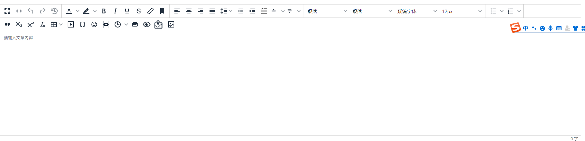

# yii2-widget-media-library

#### 介绍
yii widget 媒体库

#### 安装教程

1.  composer require yuankezhan/yii-tiny-editor


#### 使用说明


```
<?php
use yii\helpers\Url;
use yuankezhan\yiiTinyEditor\TinyEditor;
    // classId = 'editor';//编辑器创建选择器
    // isShowMenu = false;
    // toolbar = ['fullscreen code undo redo restoredraft | forecolor backcolor bold italic underline strikethrough link anchor | alignleft aligncenter alignright alignjustify lineheight outdent indent indent2em beforemargin aftermargin | styleselect formatselect fontselect fontsizeselect | bullist numlist | blockquote subscript superscript removeformat table media charmap emoticons pagebreak insertdatetime print preview bdmap formatpainter mediaLibrary'];
    // languageType = 'zh_CN';
    // height = 400;//最小高度
    // inline = false;//false：经典模式，true：内联样式
    // contentStyle = '';//可直接写编辑器样式
    // contentHtml = '';
    // name = '';
    
    /**
     * 媒体库配置
     * 'mediaConfig' => [
     *     "imgListUrl" => Url::to(['media/get-img-list']),
     *     "groupListUrl" => Url::to(['media/group-list']),
     *     "addImgUrl" => Url::to(['upload/upload']),
     *     "addGroupUrl" => Url::to(['media/add-group']),
     * ],
     * @var array
     */
    // mediaConfig = [];


?>
<?= $form->field($model, 'test')->widget(TinyEditor::className(), [
    'classId' => 'editor',
    'name' => "editor",
    'mediaConfig' => [
        "imgListUrl" => Url::to(['media/get-img-list']),
        "groupListUrl" => Url::to(['media/group-list']),
        "addImgUrl" => Url::to(['upload/upload']),
        "addGroupUrl" => Url::to(['media/add-group']),
    ],
    'contentStyle' => 'html{font-size: 10px}',
])->label(false, ["class" => "control-label"]) ?>
```
